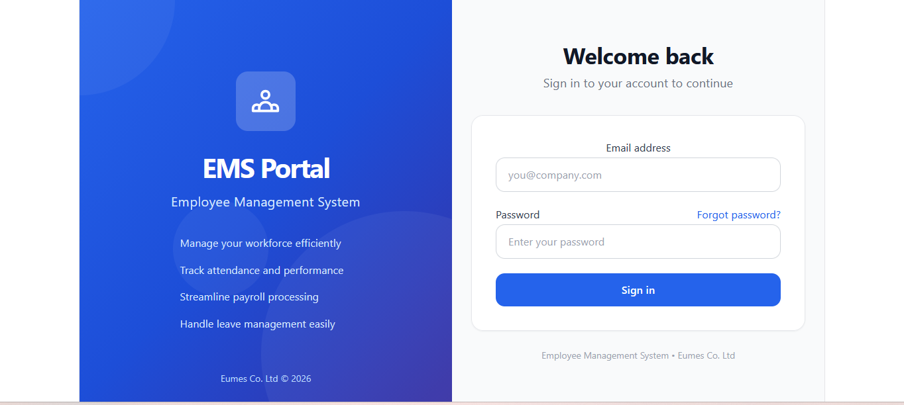
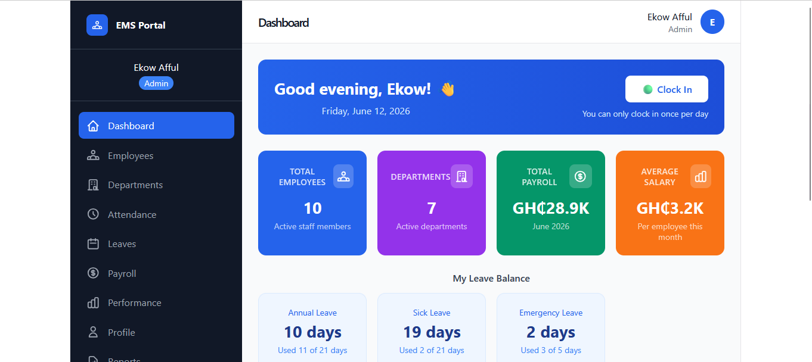
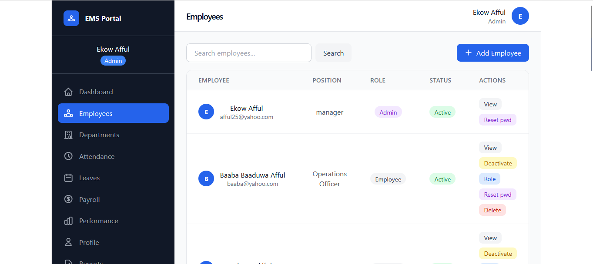
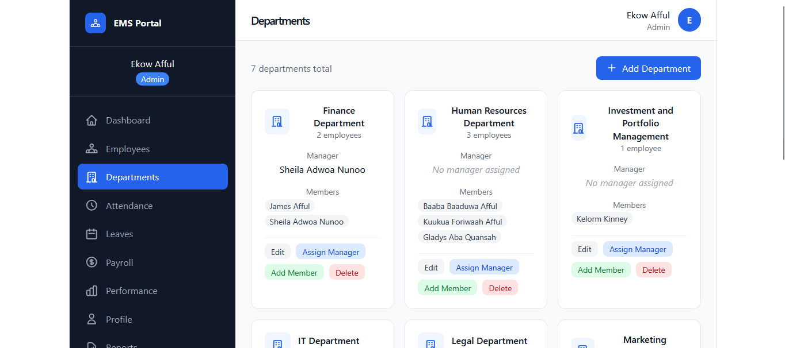
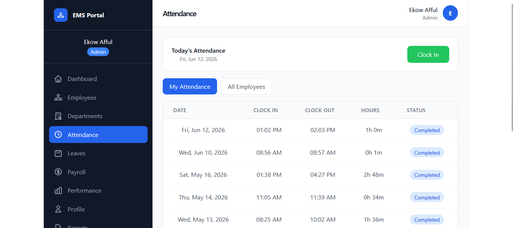
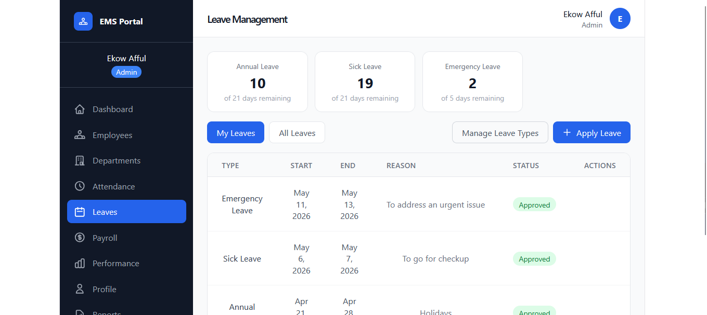
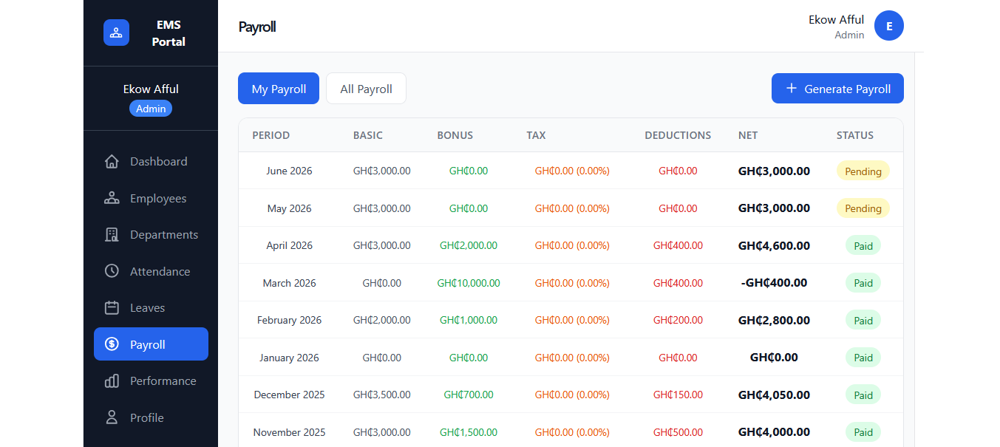
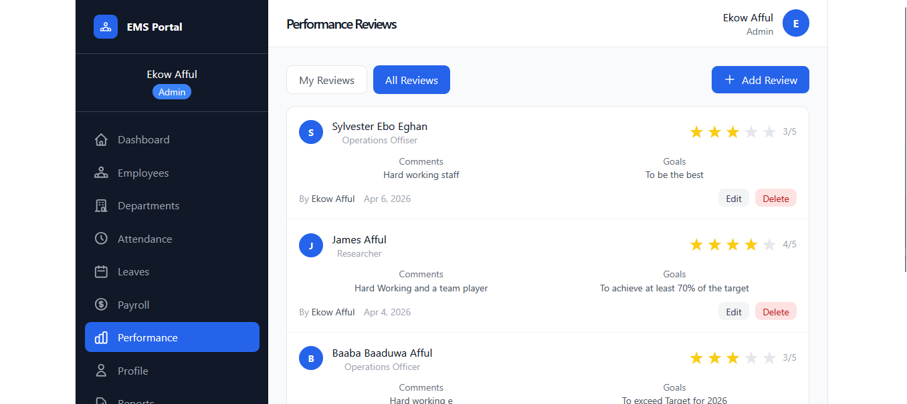

# 🚀 Employee Management System  
## Production-Grade AWS Full-Stack DevOps Platform

---

# 📌 Overview

This project is a **cloud-native Employee Management System** deployed on AWS using modern DevOps practices.

It demonstrates a complete production-style architecture, including:

- Infrastructure as Code (Terraform)
- Containerized backend (Docker + ECS Fargate)
- Secure CI/CD pipeline (GitHub Actions + OIDC)
- Scalable AWS networking (VPC, ALB, RDS)
- Centralized secrets management (AWS Secrets Manager)
- Monitoring & alerting (CloudWatch + SNS)

---

# 🧠 Architecture Overview
```text
Frontend (React on S3)
↓
Application Load Balancer (ALB)
↓
ECS Fargate (Node.js API)
↓
Amazon RDS (MySQL)
```

# 🔐 CI/CD Pipeline (OIDC Secure Deployment)
```text
GitHub Push
↓
GitHub Actions
↓
OIDC Authentication (No AWS Keys)
↓
Docker Build
↓
Push to ECR
↓
Terraform / ECS Deployment
```

✔ No static AWS credentials  
✔ Temporary IAM role assumption  
✔ Production-grade secure pipeline  

---

# 🧰 Tech Stack

## Backend
- Node.js
- Express.js
- Sequelize ORM
- MySQL (AWS RDS)
- JWT Authentication

## Frontend
- React.js
- Axios
- Hosted on AWS S3

## DevOps / Cloud
- AWS ECS (Fargate)
- AWS ALB
- AWS VPC
- AWS RDS (MySQL)
- AWS ECR
- AWS S3
- AWS Secrets Manager
- AWS CloudWatch + SNS
- Terraform (IaC)
- GitHub Actions (CI/CD)
- Docker

---

# 🏗️ Infrastructure (Terraform Modules)
```bash
infra/
├── modules/
│   ├── vpc
│   ├── ecs
│   ├── alb
│   ├── rds
│   ├── ecr
│   ├── s3-frontend
│   ├── monitoring
│   └── secrets-manager

├── main.tf
├── variables.tf
├── outputs.tf
└── backend.tf
```

✔ Modular design  
✔ Reusable components  
✔ Clean separation of concerns  

---

# 🔐 Security Design

- JWT Authentication
- Role-Based Access Control (Admin / HR / Manager / Employee)
- IAM least privilege policies
- GitHub OIDC authentication (no static keys)
- Secrets stored in AWS Secrets Manager
- Private subnets for ECS & RDS
- Security groups for service isolation

---

# 📊 Monitoring & Observability

- CloudWatch logs (ECS containers)

### Alerts
- ECS CPU utilization
- RDS CPU utilization
- ALB 5XX errors
- SNS email notifications

---

# ⚙️ Core Features

- 👥 Employee Management (CRUD)
- 🏢 Department Management
- ⏱ Attendance Tracking
- 🏖 Leave Workflow System
- 💰 Payroll System
- 📈 Performance Reviews
- 📄 Reporting System
- 📤 File Upload (S3)
- 🔐 Authentication System

---

# 📸 UI Screenshots

| Login | Dashboard |
|------|-----------|
|  |  |

| Employees | Departments |
|----------|-------------|
|  |  |

| Attendance | Leave |
|-----------|-------|
|  |  |

| Payroll | Performance |
|--------|-------------|
|  |  |

---

# 🚀 Deployment Workflow
```text
Push to GitHub
↓
GitHub Actions Triggered
↓
Docker Image Built
↓
Pushed to AWS ECR
↓
ECS Service Updated
↓
Zero-Downtime Deployment
```

# 👤 Author

**James Afful**  
Full Stack Developer | DevOps Engineer  
AWS | Terraform | Docker | CI/CD | Kubernetes 

---

# 📌 Status

✔ Project fully decommissioned (cost control)  
✔ Architecture fully documented  
✔ CI/CD pipeline implemented (OIDC secure)  
✔ Screenshots preserved as proof of deployment  
✔ Portfolio-ready DevOps project  
